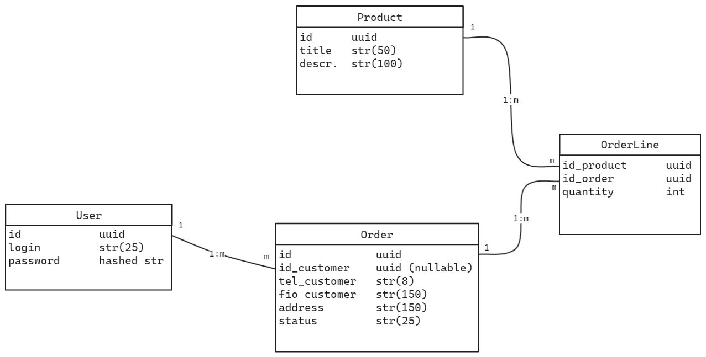

### Задание
>Создать проект на любую тему с примерно 4мя сущностями. Создать трехслойную архитектуру MVC: Entity, Services, Controllers, Repositories. Создать один абстрактный репозиторий (через использование дженериков), от которого отспециализировать все остальные репозитории. Использовать рефлексию для этого абстрактного репозитория.

### Функционал
Магазин-кофейня, который продает как кофе, так и допы к нему (пончики-сиропы-кофейные зерна). Можно сделать заказ, указав адрес, контактные данные, и отслеживать его статус.

### Сущности
- товар
    - айди
    - название
    - описание
    - ~~количество на складе~~
- заказ
    - айди
    - айди покупателя (nullable)
    - телефон покупателя
    - фио покупателя
    - адрес доставки
    - статус
- строки корзин (корзина)
    - айди
    - айди товара
    - количество единиц товара
- пользователь
    - логин
    - пароль

### Схема сущностей для БД
